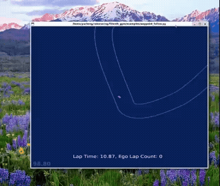
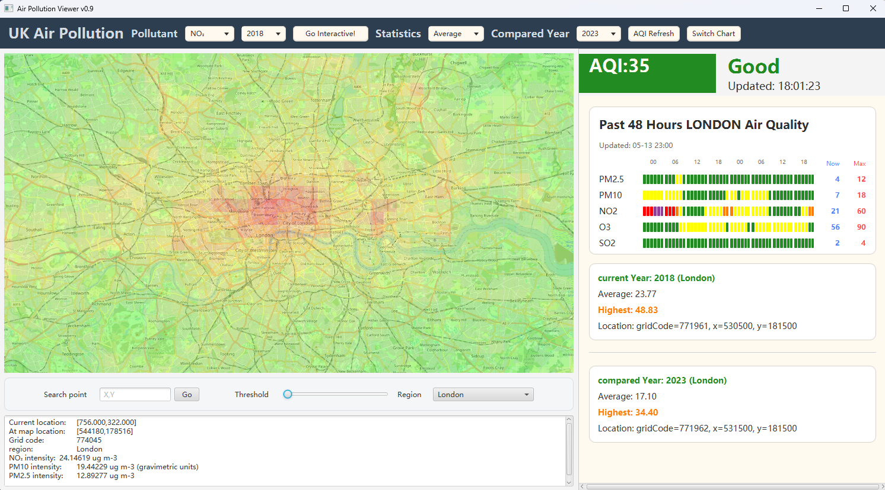

<h1 align="center">卓宇城 | Yucheng Zhuo</h1>

伦敦国王学院（KCL）计算机科学专业 大一

---

## 技术栈

### 编程语言

### 开发工具

---

##  学习方向

- 数据结构与算法
- 后端开发
- 数据库

---

## 当前目标

- 基于ICRA Roboracing项目学习强化学习（RL）
- ROS开发
- 深入学习后端架构
---

## 项目经历

### F1TENTH 自动驾驶强化学习环境

基于 WSL2 + Ubuntu 搭建 F1TENTH Gym 自动驾驶强化学习环境。
## Demo

目前已完成：

- 仿真环境部署
- Waypoint Following 基础实验
- 强化学习实验流程搭建

技术栈：

- Ubuntu
- WSL2
- Python
- Reinforcement Learning

---

### 伦敦空气质量 JavaFX APP

基于 JavaFX 开发的空气污染可视化系统。
## Demo

[▶ 演示视频](https://b23.tv/tG76saT)

实现功能：

- 实时 AQI 数据接口
- 污染物筛选
- 趋势分析
- 动态 UI 展示
- 数据索引与筛选

技术栈：

- Java
- JavaFX
- GitHub Collaboration

---

### Arduino Nano 嵌入式实验

基于 Arduino Nano 开发板实现基础嵌入式控制实验。

实现内容：

- LED 闪烁
- 跑马灯效果
- GPIO 输出控制
- 定时循环逻辑

---

English Introduction

# Yucheng Zhuo

Computer Science student at King's College London in the First Year.

## Tech Stack

### Toolkit

## Featured Projects

### F1TENTH Reinforcement Learning Environment
## Demo

Built an autonomous driving reinforcement learning environment using:
- WSL2
- Ubuntu
- F1TENTH Gym

Current progress:
- Waypoint Following
- RL environment deployment
- Simulation workflow setup

### London Air Quality JavaFX App

A JavaFX-based air pollution visualization system.
## Demo

[▶ Demo](https://b23.tv/tG76saT)

Features:
- Real-time AQI API
- Pollution filtering
- Trend analysis
- Dynamic UI
- Data indexing

### Arduino Nano Embedded System Experiments

Implemented:
- LED blinking
- Running light effects
- GPIO control
- Timing logic

